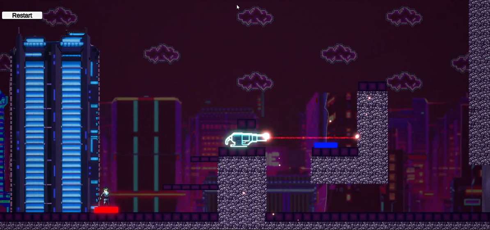
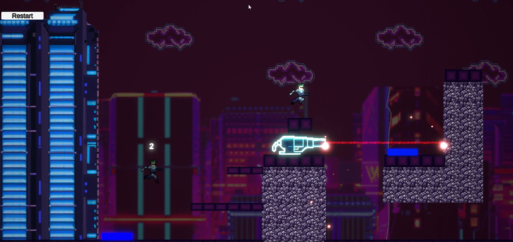

# CursedHeroOfThePast

Welcome to CursedHeroOfThePast, a 2D pixel art video game where you play as a hero who can rewind time to solve puzzles.

## About the game

In CursedHeroOfThePast, you play as a hero who has been cursed to relive the same day over and over again. However, you have the ability to rewind time and change the events of the day to try and break the curse.

As you progress through the game, you'll encounter various puzzles that you'll need to solve using your time-rewinding abilities.

## Installation

To install CursedHeroOfThePast, follow these steps:

1.  Go on the [itch.io game page](https://polimi-game-collective.itch.io/cursed-hero-of-the-past)
2.  Download the game or play it directly on the browser

## How to play

Use the arrow keys or the WASD keys to move your character around the game world.
Press the "C" key to create a clone of yourself that rewind your last actions and press "C" again to teleport to your clone.
Press the Left Shift key to perform a Dash. The Dash has a 1 second cool down.

You can also access the in-game menu by pressing the "Esc" key and adjust the game settings.

## Feedback

If you have any issues with the game or have any suggestions for improvement, please open the feedback field in the menu. We welcome all feedback and will do our best to address any problems you may encounter.

Thank you for playing CursedHeroOfThePast! We hope you enjoy the game.